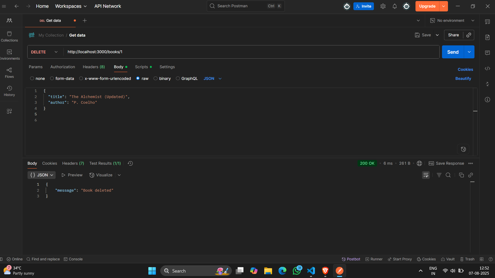

# 📚 Books REST API — Task 3

This project is a simple REST API for managing a list of books using **Node.js** and **Express**. It supports all CRUD operations (Create, Read, Update, Delete).

---

## 🚀 Features

- **GET /books** → Get all books  
- **POST /books** → Add a new book  
- **PUT /books/:id** → Update book by ID  
- **DELETE /books/:id** → Delete book by ID  
- In-memory book storage (No database used)

---

## 🧰 Tools Used

- Node.js
- Express.js
- Postman (for testing)

---

## 🖼️ Postman Screenshot



---

## 📁 Project Structure
books-api-T3/
├── images/
│ └── postman_ss.png
├── index.js
├── package.json
└── README.md
## 🧪 How to Test

1. **Start the Server**  
   Open terminal and run:
   ```bash
   node index.js
   ```

2. **Test the API using Postman**

   - ✅ **GET all books**  
     `GET http://localhost:3000/books`

   - ➕ **Add a new book**  
     `POST http://localhost:3000/books`  
     Body (JSON):  
     ```json
     {
       "title": "Book Title",
       "author": "Author Name"
     }
     ```

   - 📝 **Update a book by ID**  
     `PUT http://localhost:3000/books/:id`  
     Example: `http://localhost:3000/books/1`  
     Body (JSON):  
     ```json
     {
       "title": "Updated Title",
       "author": "Updated Author"
     }
     ```

   - ❌ **Delete a book by ID**  
     `DELETE http://localhost:3000/books/:id`  
     Example: `http://localhost:3000/books/1`


